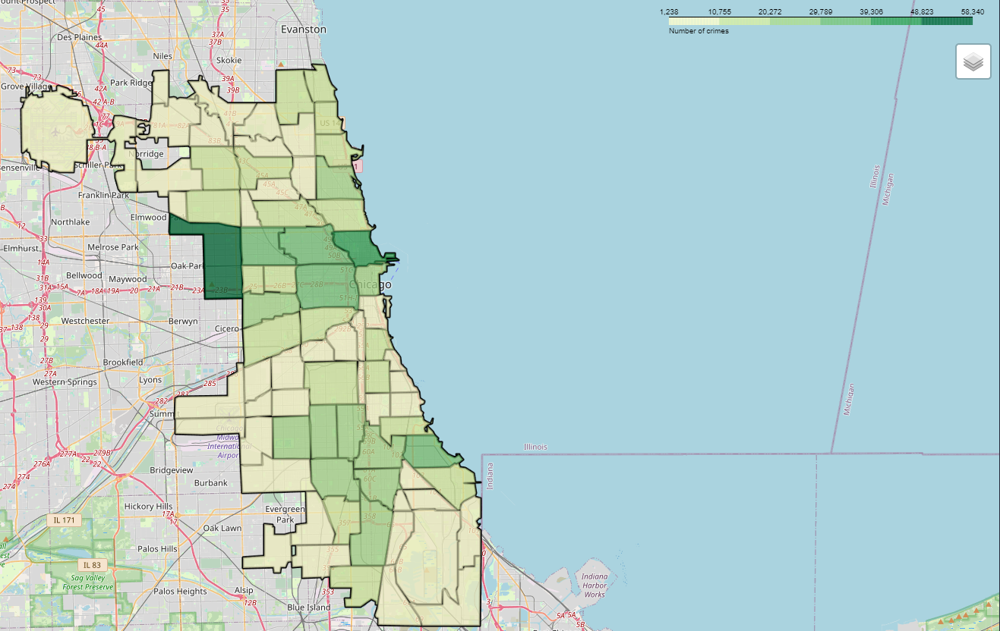
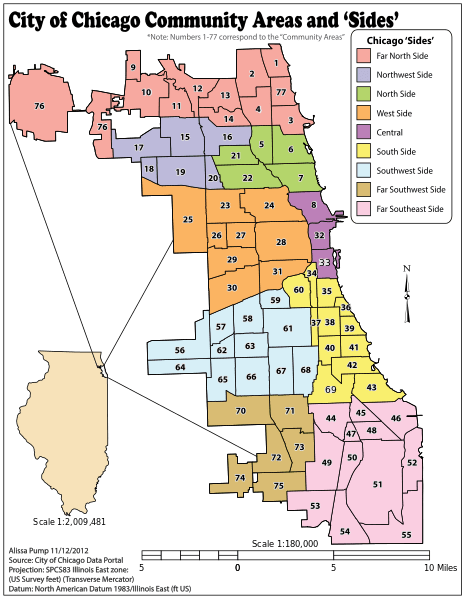
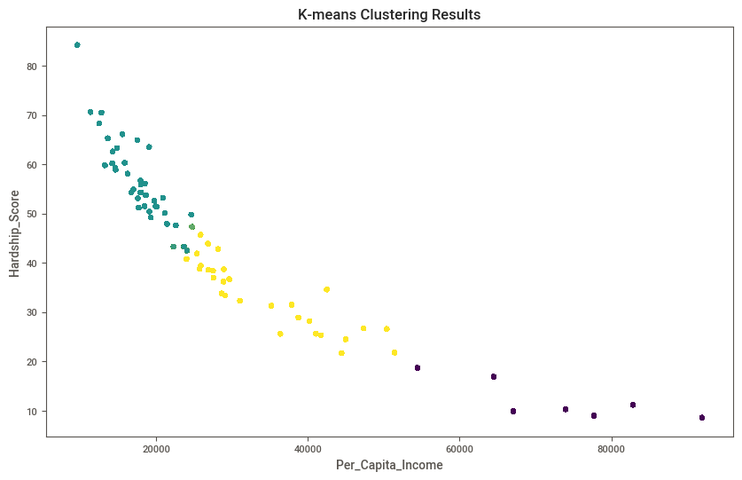
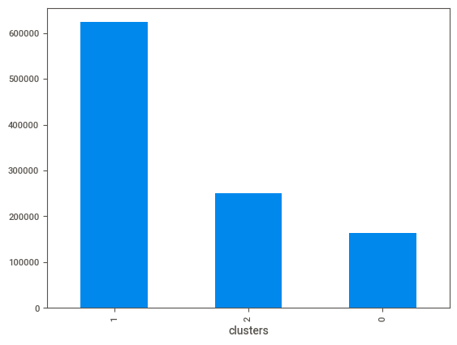
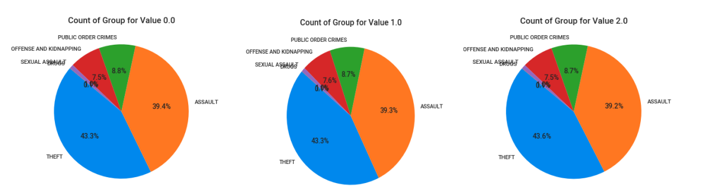
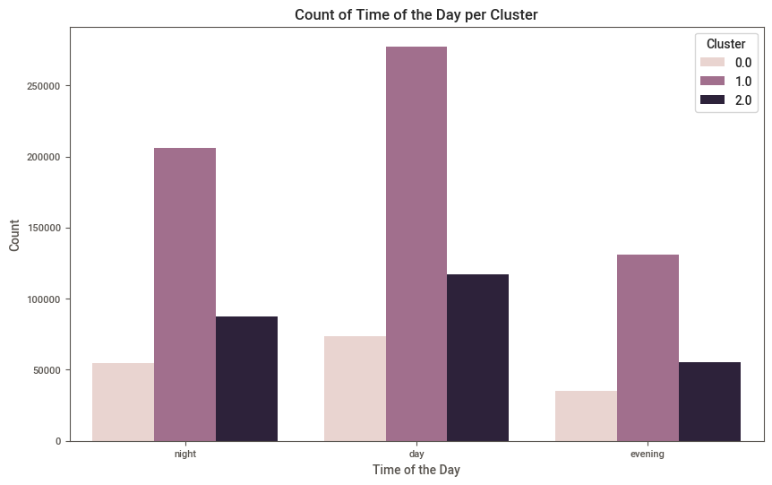
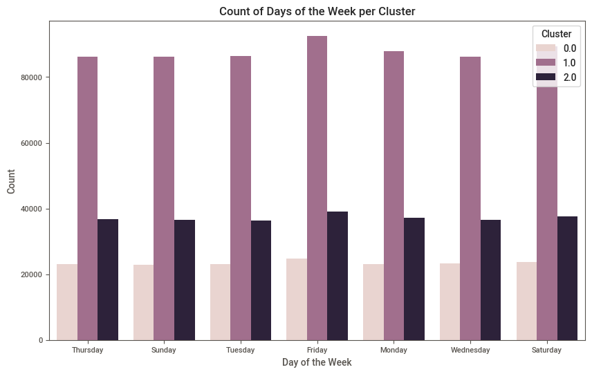
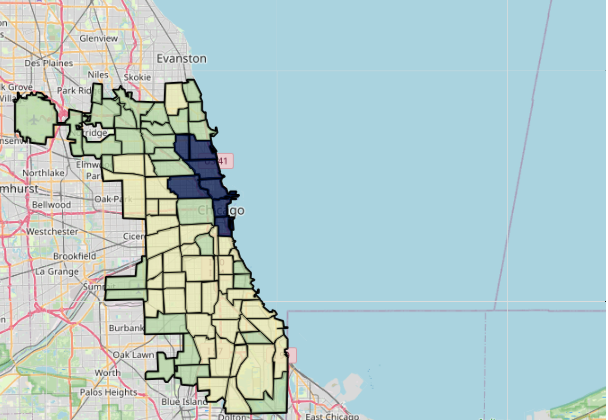
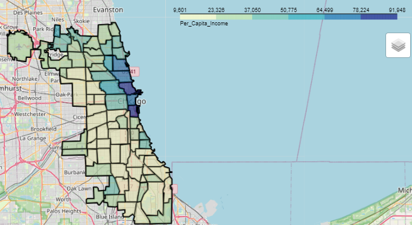

# Analyse des facteurs de criminalité à Chicago 
## Problématique
De nos jours les crimes et l’insécurité conséquente augmentent de manière significative dans nos sociétés qui peuvent être dû à plusieurs facteurs nous nous sommes intéressés dans ce projet à étudier d’un point de vue socio-économique. En particulier, la ville de Chicago est l’une des villes des États-Unis les plus dangereuses causé par le nombre de meurtres. Dans ce sens, nous nous sommes fixés comme objectif pour ce projet d’analyser si les facteurs socio-économiques ainsi que d’autres attributs peuvent donner une explication pertinente pour le nombre de crimes et leurs types dans la ville de Chicago. 
## Source des données
La première est une base de données des crimes dans la ville de Chicago de 2001 à 2024 que nous avons trouvé dans un site gouvernemental des États-Unis représentant un [catalogue de données publique](https://catalog.data.gov/dataset/crimes-2001-to-present). La deuxième base donnée représente les données socio-économiques dans chaque espace communautaire dans la ville de Chicago (il en existe 77 au total) entre les années 2013-2017, cette base de données a été extraite d’un [article statistique](https://greatcities.uic.edu/wp-content/uploads/2019/12/Hardship-Index-Fact-Sheet-2017-ACS-Final.pdf).
## Représentation de la quantité de crime de chaque communauté de Chicago
On voit particulièrement que les communautés du secteur West Side, en particulier Austin (25), et Central possèdent les plus grands nombres de crimes. Ce graphique sera par la suite comparé avec les résultats de notre modèle de segmentation.

  
  

## Analyse des résultats
Après l'entraînement de notre modèle de clustering avec 3 clusters, nous avons extrait les deux colonnes les plus discriminantes pour la partition des données par des méthodes statistiques. 

  

Le nombre de crimes présent dans le cluster 1 est significativement supérieure aux deux autres (614 920 crimes au total), avec le cluster  0 ayant le moins de crimes, soit 163 713, et le clusters 2 avec 259 980.

  

En lien avec l’étude du nombre de crimes, une autre partie de cette étude consistait à analyser l’impact 
des facteurs extérieures sur le type de crime commis. Cependant, les prochaines figures démontrent que 
la proportion des types de crimes sont similaires parmi les trois clusters. On en conclut que notre modèle 
n’est pas discriminant sur les types, mais uniquement sur la quantité des crimes

On poursuit avec l’analyse de la période de la journée ainsi que la semaine pour voir que celles-ci sont 
équitablement réparties tel que démontré par ces deux histogrammes. De ce fait, toutes les informations 
concernant le type, l’emplacement, le jour et la période de la journée n'ajoutent aucune information 
supplémentaire au modèle lors de regroupement et ce résultat nous montre qu’il n’est pas très performant 
pour notre analyse de crime.

  
  

On termine l’analyse par une visualisation à l’aide d’une carte qui présente quel cluster est 
majoritairement présent pour chaque communauté et le Per_Capita_Income associé. Les deux cartes 
suivantes démontrent qu’il y a effectivement une relation, on voit que les communautés de cluster 1 
(jaune) sont celles avec le plus bas revenu par habitant (jaune). Le cluster 0 est de couleur bleu foncé 
tandis que le cluster 2 de couleur verte. Les résultats sont conformes avec le graphique initial à 
l’exception qu’un grand nombre de crimes était aussi causé dans les communautés du cluster 0 (les plus 
riches).

  

  
  
  

